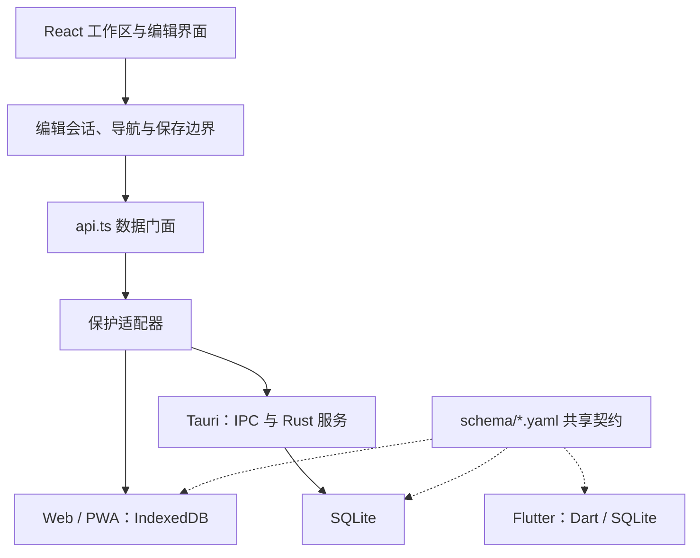

# Nine Rings 当前关键设计

更新时间：2026-10-10。本文总结当前 Web/PWA 与 Tauri 的实现和必须保持的约束，作为专题设计的统一入口。Flutter 仅说明现状，不制定新的迁移方案。插件宿主及其统一修订协议仍为草案。

## 1. 定位与核心原则

Nine Rings 是本地优先的文档工作区：用路径组织文档，用类型、概念、标签与关联检索，正文兼顾结构化编辑和 Markdown 源码编辑，PDF/EPUB 阅读与文档摘录共存。

| 原则 | 当前选择 | 必须保持的约束 |
| --- | --- | --- |
| 内容完整性 | 保存、导出、导航有明确边界 | 保存回显、缓存和临时 DOM 不能覆盖未保存编辑 |
| 编辑连续性 | 最近三份普通文档保留实例 | 首页往返保留会话，敏感文档离开即锁定 |
| 本地优先 | Web 使用 IndexedDB，Tauri 使用 SQLite | GitHub 是可选备份服务，离线编辑不依赖它 |
| 共享行为 | Web 与 Tauri 共用 React 编辑和展示层 | 平台能力由适配器接入，模拟不替代原生验收 |
| 渐进优化 | 缓存派生模型，限制控件及测量工作量 | 不破坏原生选区、输入法、复制和撤销 |
| 计划与实现分开 | 现有扩展与插件草案分别记录 | 不承诺未实现的公开 SDK、实时协作或跨视图共享撤销 |

## 2. 分层与数据契约

`src/lib/api.ts` 是 UI 数据访问门面。`storage/index.ts` 按环境懒加载适配器并包裹保护层；数据变更还处理搜索索引失效与跨窗口通知。`storage/core.ts`、操作表示和各端 driver 共享业务语义，复杂操作仍需其专用事务。通用查询不能视为无限制写入接口。

`schema/note.yaml` 与 `schema/config.yaml` 是共享字段和默认值的事实来源。共享字段变化须同步生成物与受影响端的往返验证。应用、数据库迁移、备份及内容格式分别版本化。`undefined` 表示不修改，显式 `null` 表示清空，不能互换。

### 内容权威

| 场景 | 权威表示 | 转换边界 |
| --- | --- | --- |
| 数据库与 JSON 交换 | 应用扩展的 Quill Delta JSON，含内容元数据 | 编辑器与持久模型通过转换器往返 |
| 活动富文本编辑 | TipTap / ProseMirror 文档与事务 | 保存生成 Delta 投影，回执不重置活动编辑器 |
| 活动 Markdown 编辑 | CodeMirror 文本与源码导航会话 | 解析模型、目录和预览由源码派生，保存投影为 Delta |
| 块工作区与只读视图 | 主编辑会话的派生视图 | 局部编辑通过主事务提交，不独立保存整篇文档 |
| Flutter 既有编辑 | flutter_quill 文档 | 直接读写 Delta，尚未迁移 React 的 Markdown 内核 |

TipTap 原生文档是 ProseMirror 模型，不能称为“TipTap 原生 Delta”。共享字段不代表全部扩展格式跨端无损。详见[内容权威与块工作区协议](editor-authority-and-workspace.md)。

## 3. 文档组织与定位

文档复用 `Note`：UUID 标识身份，`storagePath` 表示逻辑路径，`docType` 表示 Diátaxis 类型，`concepts`、`tags`、`linkedDocIds` 提供多维关联。逻辑路径不是操作系统文件路径，也不要求存在同名 `.md` 文件。

- `projects`、`areas`、`references`、`ideas`、`archives` 五个内置顶层路径始终显示。一般子路径从文档推导，空的受保护路径由独立记录保留。
- 点击路径名称打开文档汇总，三角只控制树展开。路径页使用摘要数据、筛选与自适应列宽，打开文档时读取正文。
- 路径移动/改名遵循规范化和存储事务；跨保护边界还需验证密码和保护身份。详见[文档树移动设计](document-tree-move-design.md)。
- 随记是 `ideas/notes` 下的普通文档，分组对应子路径，默认日期时间命名；复用普通编辑与备份，不恢复旧独立随笔模型。
- 待办存在正文任务列表中，`/todo` 创建未完成任务，不维护独立待办数据库。

`[[` 补全与标题/路径检索用于文档引用；导入保留 `originalFileName` 和来源信息，辅助解析相对 Markdown 引用。稳定引用身份不能仅靠可能重名或变化的标题。

书签用于个人阅读导航；引用锚点用于可复制的位置链接，采用 `nr-note://文档UUID#nr-ref-锚点UUID`。元数据存于 `content.metadata.referenceAnchors`，随事务映射；失效时提示，不猜测相似位置。JSON 备份保留 UUID 和锚点，单份 Markdown 不包含目标文档锚点数据。详见[引用锚点](document-reference-anchors.md)。

## 4. 编辑、源码与块操作

CommonMark/GFM 是基础语法目标。脚注、公式、Mermaid、GitHub 提示引用及受限 HTML 单独声明兼容范围；`flow`、`toc`、内部引用和手动块缩进是项目扩展。导入、粘贴、源码预览和导出复用核心解析/序列化，避免重复语法判断。

原始源码存于 `metadata.markdownSource`；没有富文本实际修改时切换源码使用原文，保留脚注定义位置。富文本修改后旧源码缓存失效，结构化导出保证支持范围内的语义，允许标记、空行和定义位置归一化。源码微渲染只改变显示，不改写字符：H1～H6 分级放大，结构与行内语法使用主题语义配色，关闭恢复普通源码显示；见[源码编辑设计](markdown-editing-plan.md#源码微渲染)。

列表归属按 GFM 的缩进与内容列解析，不能仅凭空行判断。阅读样式的“列表后的块自动缩进”和手动缩进属于独立排版规则，不反向改变解析结构。详见[Markdown 契约](markdown-compatibility.md)及[列表契约](list-editing-contract.md)。

代码、引用、Mermaid、flow 保留原始内容与配置，块号和工具是派生 UI。折叠隐藏内容，不删除内容；编辑/只读共用显示解释。flow 整体作为主文档的一块，内部步骤不是独立主块。

块工作区捕获目标快照并跟随主文档位置映射，预检后通过主编辑器事务写回；基线冲突时保留草稿，不能静默覆盖。局部视图不是第二套整篇保存权威。

块号菜单按复制、阅读、文字样式、结构、选择及删除分组；整块粗体、斜体、字号和颜色使用目标块事务，不修改相邻块。标题栏“块级操作”复用该菜单，显示块号时隐藏；多选从菜单进入，手机右划查看类型保留。只读不开放正文修改，详见[块操作设计](block-workspace-plan.md#分组与标题栏入口)。

**整篇富文本与整篇源码模式的撤销历史目前独立。** 共享持久内容不等于共享撤销栈；切换视图不承诺跨编辑器撤销。插件草案的原子批次也尚未实现。

## 5. 保存、历史与恢复

`useAutoSave.ts` 按文档汇总脏字段，延迟保存并串行提交。正文可登记轻量读取器，flush 时先冻结实际内容与字段修订，避免会话切换后读到不同内容。失败恢复仅重新排入未被后来输入覆盖的字段；队列继续运行，但具体保存调用仍报告失败。

`useNoteSessionBoundary.ts` 和导航入口在需要离开时冲刷保存。失败应保留文档、位置与未保存内容，提供重试或恢复导出。“应用到编辑器”和“已持久化”分别处理。页面隐藏/关闭只能发起异步保存，不能保证浏览器等它完成。

| 历史 | 用途 | 生命周期与备份边界 |
| --- | --- | --- |
| 编辑撤销/重做 | 撤销编辑器事务 | 内存会话历史，不是数据库快照 |
| 导航后退/前进 | 恢复文档、位置、视图与显式跳转 | 不因每次编辑新增导航项 |
| 文档版本快照 | 回看或恢复保存版本 | 本地 `note_versions`；普通版本历史不进入当前 JSON/GitHub 全量备份 |

加密文档备份另含 `protected_versions`，不代表导出了所有普通历史。**提交/推送本项目源码不会备份应用数据库。** 详见[导航历史](document-navigation-history.md)。

autosave 字段计数用于失败恢复，`updated_at` 用于缓存/变更识别，都不是统一公开修订令牌。插件提出的文档代次、内容修订和保存确认水位需后续实现。

## 6. 工作区会话与分栏

普通文档最多保留三份完整会话，按最近使用淘汰；小型转换缓存是另一层。后台 DOM 移出活动页面，避免参与焦点、命中测试和全文 DOM 查询。后台会话不响应当前文档操作，不用隐藏期间的几何数据覆盖位置。

进入首页是展示状态变化，保留文档及 PDF/EPUB 实例。离开首页遵循以下规则：

| 首页期间操作 | 文档/阅读器 | 分栏 |
| --- | --- | --- |
| 未打开新文件，返回上一页面 | 恢复此前内容 | 恢复原面板、隐藏和固定状态，取消遗留计时器 |
| 从树/列表打开文档 | 显示新文档，保留旧缓存会话 | 沿用悬停/固定模式，选择文件不自动固定 |
| 从全局搜索打开文档 | 显示搜索目标 | 不主动改变分栏模式 |
| 从阅读分栏打开 PDF/EPUB | 主区域显示新书，返回仍显示新书 | 收回资料库浮层/固定分栏，避免空白区 |

树、列表、随记、阅读资料库属于工作区分栏；目录和书签属于正文导航面板。桌面支持悬停/固定，手机使用抽屉与边缘手势，不套用桌面固定状态。宽度、比例与本机偏好分别持久化。专注模式不改变正文和阅读位置。详见[布局](workspace-layout.md)与[首页恢复](web-workspace-chrome.md)。

## 7. 搜索、目录与概览

全局搜索、渲染查找和源码查找复用 `search-matching.ts`，支持大小写、整词及 Perl 兼容 PCRE2 WASM 正则。引擎本地按需加载，限制匹配/深度，错误模式明确提示，零宽命中不作为普通结果。源码偏移与 ProseMirror 位置需映射，不能直接互换。

目录来自文档模型标题索引。`/toc` 只存级别配置，列表动态派生；长标题限制目录显示，不截断正文或链接目标。源码目录跟随光标，渲染目录跟随位置，导航可展开章节并进入历史。

概览统计与列表读取摘要，点击时再加载正文；最近访问不同于最近修改。本机访问/编辑记录驱动最近打开标识，不根据导入时间推断本机编辑。弹层/分栏展示按设置选择，避免悬停造成正文伸缩。

## 8. 大文档与资源加载

默认保留完整 ProseMirror 文档和正文 DOM。实验性只读局部渲染有能力检查和回退，不等于全文可编辑虚拟化。

- 块号控件按视口窗口挂载，复用模型到 DOM 的映射；滚动用有序块二分定位，避免逐帧整页命中测试。
- 标题、折叠及转换缓存按不可变文档/插件状态失效；选区变化不重复遍历全文。
- 增量序列化复用顶层节点，但保存仍组装完整 Delta；大列表仍可能是一个转换单元，不是增量数据库写入。
- 虚拟目录测量自然高度并复用观察器；Top/Mid/Bot 随迟到布局校正，真实用户输入立即取消校正。
- 图表延迟启动，代码行号只为可见块测量；已加载图形保持稳定，避免高度跳动。
- 大解析、转换和搜索借助 Worker，重依赖按需拆包；本地 WASM/字体/图表资源兼顾离线与 Tauri CSP。

证据记录同场景工作量与耗时，不能推导手机帧率保证。首次解析、布局及完整 DOM 内存仍随规模增长。详见[大文档设计](large-document-performance.md)。

## 9. 外观与交互

风格、配色、布局、正文宽度/密度及排版覆盖分别管理。非经典风格共用正文排版基础，风格主要表达视觉气质；经典保留独立基础。标题/块字号与字体默认覆盖值保留响应式规则，代码默认等宽。

路径和目录标题可独立设置六层循环配色，末端文档名称不参与路径着色。外观不覆盖正文显式格式或 Mermaid 源码样式，不改持久内容。桌面设置可按住外侧遮罩预览，手机保留原交互。详见[视觉体系](visual-system-demo.md)。

## 10. 阅读器与 PDF 导出

PDF/EPUB 原文件、阅读进度、书签与批注在设备资料库保存；摘录生成普通文档并保留回源信息。阅读器与资料库分栏分开，手机阅读器独占视口。边界限制与恢复操作保证 splitter 能重新触达。

单书 `*.reading.json` 使用完整内容分块指纹匹配目标文件，先预检再确认，在单书资料库事务内合并；不含原文件，也没有跨窗口阅读会话锁。详见[阅读数据备份](reading-data-backup.md)。

文档 PDF 导出采用渲染正文，去除编辑控件，等待资源；显式目录块展开为实际目录，flow 等使用打印渲染。Web 使用浏览器打印，Tauri 使用独立 `pdf-print-*` WebView 与原生命令。预览不继承主窗口全部权限，也不关闭到托盘。PDF 查看器侧栏书签仍取决于打印引擎。

## 11. 备份、保护与多窗口

应用 JSON、紧急恢复导出和 GitHub 快照共用格式，包含当前文档、必要保护记录、模板、配置及允许的非敏感用户设置。普通回收站文档、普通版本历史、PDF/EPUB 原文件和设备阅读数据不进入此备份。凭证与密钥排除。“全量”不意味着本机所有数据都已覆盖。

GitHub 备份有快照比较与冲突处理，不是操作日志同步或实时协作。JSON 导入与 GitHub Pull 使用同源 Web Lock 协调，中断记录帮助检测失败；不锁普通编辑，不是跨数据库与 localStorage 的原子事务。中断后需检查，不自动重放。详见[恢复协调](backup-restore-coordination.md)。

文档/路径保护已实现：`document-crypto.ts` 负责密码派生和密文，保护适配器约束访问。标题、路径等定位信息公开；解锁正文也不进入全局搜索/摘要，离开释放解密会话。密码与密钥不持久化，旧明文备份不会追溯删除；标准密码学 API 不代表已完成外部安全审计。Flutter 等旧端兼容须单独验证。详见[加密边界](document-encryption.md)。

## 12. 启动、退出与版本更新

关闭到托盘与退出不同。macOS 双次 Command+Q 确认路径等待前端保存，再清理数据库/资源并请求退出，不增加固定等待；托盘退出不能作为前端保存握手成功证据。

桌面在应用数据目录记录会话阶段；下次检查前次退出，SQLite 恢复已提交 WAL 后检查完整性。失败启用只读保护，不删除数据库。高级设置展示诊断；正常退出事件不保证系统已释放所有子进程/文件锁。详见[启动与异常恢复](desktop-startup-recovery.md)。

PWA 下载与激活分开，已有等待版本仍可发现下一部署，下载失败保留已就绪版本。保存并刷新先等待保存及当前安装检查，再激活实际等待 Worker，不静默刷新丢失编辑。构建标识保持部署唯一性。详见[PWA 更新](pwa-updates.md)。

## 13. 验证与后续设计门禁

| 改动范围 | 验证重点 |
| --- | --- |
| 共享字段与存储 | Schema 一致性、Web/Tauri 契约、旧备份往返；明确 Flutter 受影响范围 |
| 编辑与 Markdown | 解析/转换、真实事务、导入/粘贴、保存/撤销，Chromium/WebKit 回归 |
| 首页与布局 | 快速往返、缓存淘汰、悬停/固定、手机横竖屏、迟到布局 |
| 性能 | CI 合成 fixture 与本机代表性文档，同场景对照，编辑/只读分别验证 |
| 平台和发布 | Rust/IPC 模拟/真机分别报告；锁文件、固定工具链与隔离目录；构建、打包、签名和运行分开验证 |

本轮仅维护文档，不代表重跑完整 E2E 或完成 Windows/Linux/iPhone 原生验收。结果见对应专题与[E2E 进度](e2e-repair-progress.md)，历史批次数字不是当前全部通过保证。

插件下一步先落实修订/保存协调器与序列化边界，再用三个内置试点验证。首次代码实现计划升至 `0.2.0`。`src/extensions/` 是编辑器扩展，根目录 `plugins/` 是构建插件，当前没有可安装应用插件宿主。详见[插件草案](plugin-system-design.md)与[版本计划](plugin-release-plan.md)。
