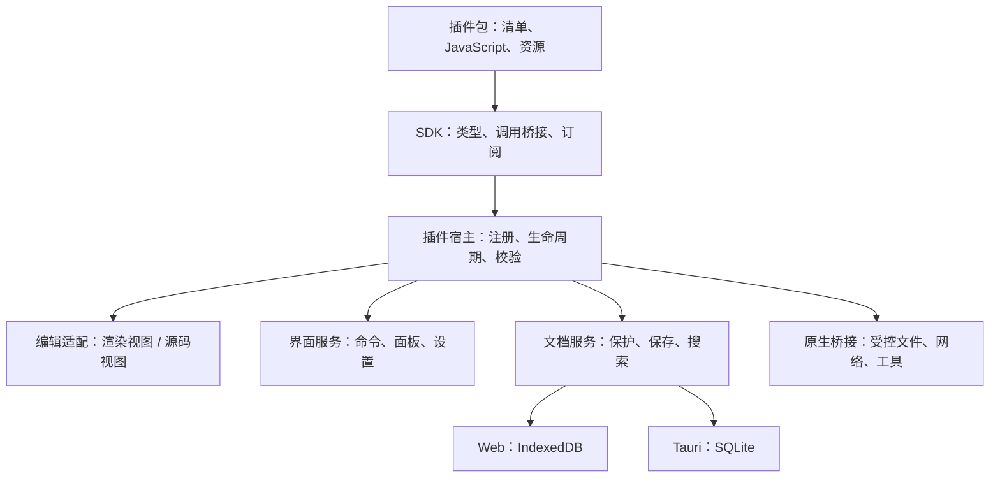
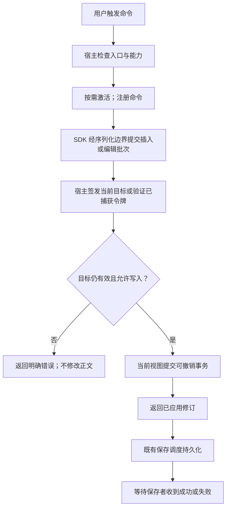

# Nine Rings 插件体系设计

| 项目 | 内容 |
| --- | --- |
| 文档状态 | 设计草案；已开始参数/schema 基础实现，完整宿主及 SDK 尚未实现或冻结 |
| 基线 | `v0.1.0` → `05e624afe40c4bc6c55b5576e412074815147ac4` |
| 日期 | 2026-10-10 |
| 本次交付 | 插件标准与前置实施；已落地参数/schema 基础，产品版本 0.2.0 |
| 后续代码版本 | 插件适配代码已提升至 `0.2.0`；安装功能尚未开放 |

当前执行顺序及前置条件见[产品完善与插件推进待办](plugin-readiness-todo.md)。本设计中的接口仍需实际接入与验证，不能仅凭新增类型标记完成。

本文采用“目标 → 约束 → 决策 → 接口 → 流程 → 实施 → 验收”的结构。产品调研用于解释选择；设计示例不代表当前功能。

## 1. 目标与核心决策

建议组合借鉴 VS Code 的声明式扩展点和按需激活、Obsidian 的笔记功能接口与资源所有权、Joplin 的代理式 API 和平台运行器。编辑器扩展继续使用现有 TipTap/ProseMirror 与 CodeMirror 机制，但通过宿主适配器接入应用插件。

首要目标是现有功能模块化：建立内部插件宿主和注册标准，保持文档模型、存储与工作区行为。首期用三个随应用发布的内置试点验证接口；第三方生态是条件触发的可选方向，不是本轮重构的完成条件。

### 1.1 要解决的问题

现有功能入口分散在编辑器、工具栏、设置和工作区中。直接开放组件内部对象，会让插件依赖实现细节，并扩大数据一致性、性能及跨平台回归的范围。先建立受控扩展点，使现有功能逐项迁移时有共同标准。

### 1.2 决策摘要

| 决策 | 选择 | 理由与验证方式 |
| --- | --- | --- |
| D01：开发形式 | TypeScript 开发，JavaScript 运行；主题/模板允许声明式资源 | 复用现有技术栈，用户端不需要编译工具；以浏览器和 Tauri 回归验证 |
| D02：首次范围 | 内置插件和最小宿主 | 三个试点覆盖编辑、持久设置、事件、面板和围栏渲染 |
| D03：核心归属 | 模型、保存、保护、导航会话留在宿主 | 插件命令必须通过既有编辑与持久化边界 |
| D04：扩展方式 | 清单贡献 + 宿主 API，按需激活 | 避免启动全部加载；注册可以统一清理 |
| D05：平台策略 | 共同浏览器 API + 显式原生能力 | 不要求 Web 拥有 Node.js、任意文件路径或进程能力 |
| D06：外部脚本边界 | 有真实需求后启动独立隔离和授权阶段 | 内部模块化不承担公开生态的稳定性成本；同进程封装不是安全沙箱 |
| D07：内容兼容 | 保存语法、无损往返、缺失时源码回退 | 停用插件后文档仍可打开、复制和导出 |
| D08：版本规则 | 产品、插件、SDK、内容格式分别版本化 | 发布执行步骤见独立计划 |
| D09：传输边界 | 首期使用可序列化请求/响应和进程内回环传输 | 同时验证回环与真实消息传输，避免后期才发现引用和回调语义差异 |
| D10：修订来源 | 宿主协调器统一维护文档代次、修订和保存确认 | 渲染/源码共享修订语义，既有 autosave 计数不能直接当公开版本 |
| D11：扩展优先级 | 先验证最小宿主，再优先声明式包和文档数据扩展 | 不因扩展编辑器而绕过保存、格式及资源边界 |
| D12：恢复与兼容 | 首期具备可选插件停用和脱敏诊断；API 先实验、后稳定 | 故障恢复不依赖失败插件执行；能力查询代替产品版本猜测 |

第一阶段不建设商店、安装脚本、任意编辑器 schema 或完整 IDE 扩展体系。核心职责明确后再逐项增加能力。

## 2. 成熟产品参考

| 参考 | 官方机制 | Nine Rings 的借鉴方式 | 需要保留的边界 |
| --- | --- | --- | --- |
| VS Code | manifest、声明式贡献、激活机制与公共 API | 静态声明命令、菜单、设置、视图；触发时加载代码 | 不承诺 VS Code 插件二进制/API 兼容，也不引入整个 Electron/Node 运行时 |
| VS Code Web | 浏览器 Worker 宿主、浏览器入口、虚拟文件系统接口 | 以浏览器可执行的共同代码为基础，原生能力单独声明 | 浏览器不能启动任意本地可执行程序；Worker 不是完整的权限沙箱 |
| Obsidian | 笔记/工作区接口、Plugin/Component 生命周期、统一清理资源 | 文档事件与编辑命令；插件、面板、文档会话分层拥有资源 | 社区插件继承应用权限的模式不作为 Nine Rings 第三方权限模型 |
| Joplin | 插件脚本经代理调用宿主 API，平台注入运行器 | 同一 API 协议连接 Web/Tauri 适配器，跨边界传递可序列化消息 | 多进程侧重稳定性；其内容脚本可在主进程执行，不能把所有扩展都称为隔离运行 |
| TipTap/CodeMirror | 编辑器层的扩展、事务与视图机制 | 宿主内部适配渲染和源码编辑；公开的是文档操作语义 | 应用插件不直接依赖编辑器 DOM、内部对象或任意动态 schema |

VS Code 将扩展能力分为声明和程序 API，扩展运行在 Extension Host，不能直接访问工作台 DOM。[扩展结构](https://code.visualstudio.com/api/get-started/extension-anatomy)、[能力概览](https://code.visualstudio.com/api/extension-capabilities/overview)、[清单格式](https://code.visualstudio.com/api/references/extension-manifest)。

其 Web 扩展有不同运行约束，文件通过虚拟文件系统 API 访问，不能创建本地子进程。[Web 扩展](https://code.visualstudio.com/api/extension-guides/web-extensions)、[Extension Host](https://code.visualstudio.com/api/advanced-topics/extension-host)。

Obsidian 的 Component 帮助管理事件、计时器及子组件的清理；官方同时明确社区插件无法可靠限制到指定权限，继承应用访问能力。[生命周期](https://docs.obsidian.md/plugins/guides/lifecycle-management)、[插件安全](https://obsidian.md/help/plugin-security)、[官方清单示例](https://github.com/obsidianmd/obsidian-sample-plugin/blob/master/manifest.json)。

Joplin 用宿主、代理和平台运行器分离调用与实现；内容脚本是不同的执行路径。[插件架构](https://joplinapp.org/help/dev/spec/plugins/)、[内容脚本 API](https://joplinapp.org/api/references/plugin_api/classes/joplincontentscripts.html)。

编辑器接口可参考 [TipTap 扩展](https://tiptap.dev/docs/editor/extensions/custom-extensions/create-new)。以上产品机制是参考资料；下文的选择与约束是针对 Nine Rings 的设计建议。

## 3. 当前架构与约束

- `src/lib/api.ts` 是数据访问门面，适配 Tauri/SQLite 与 Web/IndexedDB；插件不直接获得完整 `api`、StorageAdapter、SQL/Op 透传或数据库连接。
- `src/lib/storage/protected-adapter.ts` 承担保护逻辑，插件写入同样经过权限、文档保护和宿主校验。
- `src/components/NoteEditor.tsx` 的 `sessionExtensions` 在会话内保持稳定；最近三份文档保留实例。启停普通插件不应重建这些实例、丢失光标/折叠或撤销记录。
- `src/components/MarkdownSourceEditor.tsx` 使用 CodeMirror 的历史，渲染视图使用 ProseMirror 事务。插件 API 保证当前视图编辑可撤销；跨视图共享撤销历史仍是独立问题。
- `src/hooks/useAutoSave.ts` 已有按文档、字段递增的 `revisionsRef`，用于保存失败时保护后来编辑；计数未作为统一文档修订或保存确认公开。第一阶段需适配现有保存队列，不能假设 `updated_at` 或一个返回成功的 `flush()` 就证明任意修订已保存。
- `src/lib/incremental-document-serializer.ts`、`src/lib/delta-converter.ts` 及 Markdown 解析/序列化负责持久内容。第三方自定义节点若不能往返，不能仅因编辑器支持注册节点就公开。
- `src/extensions/` 是内置编辑器扩展；根目录 `plugins/` 是 Vite 构建插件。两者都不等于未来可安装的应用插件。建议新宿主用 `src/lib/plugin-system/`，避免混淆。
- `src-tauri/capabilities/default.json` 限定主窗口的平台能力，但应用自定义命令还需单独审计，不能假设所有 IPC 都已受逐插件权限约束。

## 4. 目标架构与功能边界

### 4.1 分层关系



从首期起，内置插件也经 SDK → 可序列化请求/响应 → 宿主分发器调用；首期传输是进程内回环，后续可以替换为消息通道。请求参数、响应及事件都经过 JSON 数据约束和校验，不通过共享引用绕过边界。测试同时覆盖真实克隆传输以发现回环遗漏。

命令和事件回调只注册在 SDK 客户端，宿主保存处理器 ID，通过执行/事件消息调用它们。Promise、函数、编辑器对象、DOM 和 AbortSignal 不进入消息载荷；取消用请求 ID 与控制消息传输。宿主内部可以依赖实现对象，插件接口不返回这些对象。回环传输不提供对恶意同进程代码的安全隔离。

### 4.2 核心与插件的职责

| 保留在核心 | 可逐步成为内置插件 | 开放前需专门验证 |
| --- | --- | --- |
| 文档模型、存储、自动保存、版本历史 | 模板、日期插入、统计、部分菜单操作 | 任意第三方安装与外部执行 |
| 保护、加密、内容迁移、启动恢复 | GitHub 功能入口及其所需服务适配 | 原生文件与进程授权 |
| 当前编辑器事务、驻留文档与导航状态 | PDF/EPUB 阅读模块 | 插件启停对阅读状态与资源的影响 |
| Markdown 解析与序列化基础 | Mermaid、公式、flow 等渲染 provider | 新语法/节点的持久格式和导出回退 |
| 工作区框架、基本菜单和布局 | 主题资源、可选概览面板 | 手机入口及各主题可读性 |

“可插件化”表示适合建立模块边界，具体迁移必须先完成依赖梳理。首期内置插件随应用打包；支持独立安装属于后续阶段。

## 5. 插件标准

### 5.1 清单、身份与兼容

清单声明 `manifestVersion`、全局唯一 `id`、名称、插件版本、宿主 API 版本范围、运行平台、贡献项和所需权限；脚本包另有执行入口，声明式包不需要入口。命令、面板、设置及数据键均以插件 ID 命名。

宿主先验证清单和兼容性再执行入口。不兼容或重复 ID 给出明确原因。第一阶段内置包由构建时校验，不要求用户安装 npm 或编译插件。完整依赖图、商店、收费、评分和复杂安装脚本暂不纳入最小标准。

`manifestVersion: 1` 仅用于内置试验格式，不是对第三方发布的长期兼容承诺。平铺权限字符串约束宿主接口；未来带网络/文件作用域的授权须另行设计和升级清单版本。

示意清单，字段细节待三个试点验证：

```json
{
  "manifestVersion": 1,
  "id": "nine-rings.insert-date",
  "name": "插入日期",
  "version": "0.1.0",
  "engines": { "nineRingsPluginApi": "^0.1.0" },
  "platforms": ["web", "desktop"],
  "entry": "index.js",
  "activationEvents": ["onCommand:nine-rings.insert-date.insert"],
  "permissions": ["editor.selection.read", "editor.selection.write"],
  "contributes": {
    "commands": [{
      "id": "nine-rings.insert-date.insert",
      "title": "插入日期",
      "description": "在当前选区插入本地日期",
      "parameters": { "type": "object", "properties": {}, "additionalProperties": false }
    }],
    "keybindings": []
  }
}
```

`desktop` 表示 Tauri 桌面环境，不意味着 Web 桌面浏览器具有原生能力；手机 Web/PWA 仍属于 `web`。首期不扩展 Flutter 或 iOS Tauri。

### 5.2 声明式入口与按需激活

宿主根据贡献项生成入口和可用状态。菜单条件采用有限、可校验的上下文，如当前视图、是否有文档、是否可编辑和平台能力；不执行清单里的任意表达式。

插件可声明命令、设置、侧栏/弹层和状态展示。宿主管理手机入口、分栏宽度、固定/悬停模式与主题。开机不遍历全文或激活所有插件；首次执行命令或打开面板时加载对应代码，并合并并发激活请求。

命令声明包含名称、说明和参数 schema。首期采用有大小/深度上限的 JSON Schema 子集：基本类型、枚举、必填项、有限对象与数组；不允许远程 `$ref`、自定义执行器或任意表达式。无参数命令也声明空对象。宿主在激活前检查声明、调用时检查参数及可用状态，面板、菜单和快捷键复用同一声明。未来自动化或 AI 入口仍需独立的用户意图、授权与写入保护，声明本身不自动开放这些入口。

### 5.3 生命周期与所有权

建议状态为发现、未启用、激活中、已激活、停用中、失败。生命周期入口为 `activate(context): void | Promise<void>` 和可选 `deactivate(reason): void | Promise<void>`，清单发现不等于执行入口。

激活失败或超时回滚注册并取消当前激活代次，随后完成的初始化不能再次注册资源。停用先拒绝新调用、触发取消，再等待有超时的 `deactivate`，最后无论回调成功与否都回收资源。收尾阶段只允许宿主明确开放的资源关闭/插件偏好写入；不再允许编辑正文或创建新任务。清理后的迟到结果被拒绝。

所有注册返回可释放句柄，由宿主的资源容器托管。分别定义插件级、面板级和文档会话级作用域；文档从当前视图隐藏不等于驻留会话被销毁。插件级初始化与某个文档打开不能混为一个事件。

异步任务携带取消信号及会话标识，停用或文档切换后返回的结果不得写入错误文档。对激活、跨边界调用和清理设超时并记录失败。主线程内置插件无法可靠中断死循环，应避免宣称其具备强故障隔离。

### 5.4 公共 API 与编辑一致性

首期通过统一序列化协议提供命令、通知、设置/存储、必要文档快照、结构化插入、面板与有限围栏渲染接口；SDK 的类型化外观和宿主执行端使用同一契约校验。函数和编辑器对象不进入请求或响应。

内容修改通过宿主命令处理，明确文档 ID、视图/会话、基础修订和目标位置。宿主提交前再检查修订、只读/加密状态和选区；冲突返回可识别错误，不能覆盖后来编辑。

渲染视图适配 ProseMirror 事务，源码视图适配 CodeMirror 事务。保存仍走既有调度；通知“修改已应用”与“已持久保存”分开。只读渲染中的文本选择由对应视图接口读取，不假定所有选区都是编辑器光标。

存储中的文档修改与当前编辑器事务有不同历史语义，接口需要区分。不得以直接改 DOM 或直接 `api.notes.update` 绕过当前编辑器会话。

### 5.5 权限、执行隔离与运行平台

内置插件随仓库审查和应用构建发布，仍经过宿主 API 的数据保护和平台检查；此阶段的清单权限是接口约束，不构成对任意同进程恶意脚本的安全隔离。

开放第三方代码前，需要实现可撤销的权限授权、作用域和执行隔离。当前文档读取、工作区搜索、文档写入、指定网络目标、用户选择的文件范围及外部工具调用分开授权。插件不取得全局凭证、数据库或任意原生命令入口。

纯计算可放到 Worker，UI 用隔离视图与消息协议；Worker 的异线程执行并不阻止网络等所有能力。还需实际的来源隔离、CSP、消息校验与原生 API 拒绝策略。具体实现必须在 WebKit、Chromium 和 Tauri 原生环境做能力越权测试后再定稿。

Tauri 原生能力由宿主桥接，平台权限与逐插件授权两层校验。官方说明应用自定义 `invoke_handler` 命令默认可用于应用窗口/WebView；需要 AppManifest 命令权限及/或调用方校验，不能只依赖插件 UI 隐藏按钮。[Tauri capabilities](https://v2.tauri.app/security/capabilities/)。

浏览器插件使用文档 ID 和宿主提供的资源句柄，不假设真实文件路径可见；ctags、外部进程等能力单列为桌面专用，Web 给出可用替代或明确不可用状态。

### 5.5.1 能力层级与声明式包

| 层级 | 内容与执行方式 | 开放前提 |
| --- | --- | --- |
| L0：声明式包 | 主题变量、模板/片段、快捷键映射、导出配置、有限查询/视图定义，由宿主解释 | 对应解释器、格式校验、大小/复杂度限制和卸载回退通过验证 |
| L1：脚本 | TypeScript/JavaScript；首期仅随应用发布的可信内置模块 | 外部代码须另行满足隔离、来源和授权门禁；内置同进程运行不称为沙箱 |
| L2：原生能力 | 文件、外部工具/进程等由宿主代理 | 平台能力及逐项范围授权，不给插件任意原生命令入口 |

这是能力划分，不是三个必须顺序完成的发布阶段。L0 包允许没有 `entry`；不能带事件脚本、任意 HTML 或全局 CSS。主题用宿主允许的变量，模板走现有解析/安全链接路径，查询用有限声明式条件，导出配置不能执行命令。资源来源与读取权限、压缩包路径、JSON/YAML 解析、数据体积、查询开销均须校验；“不执行代码”不等于没有安全问题。元数据、查询视图和导入/导出扩展优先于任意编辑器 schema，仍需避免大量扫描、跨文档批处理和覆盖用户数据。

第三方声明式包可在相应解释器和门禁独立完成后先于第三方脚本开放，不要求先建设完整脚本宿主；目前仍未提供包安装器。首次三个试点和版本提升计划不因此扩大。

### 5.6 文档格式、渲染与卸载

首个 provider 仅支持带语言标记的围栏代码块。宿主拥有现有 `codeBlock` schema 和稳定 NodeView，内部按语言查询 provider 注册表；启停只更新渲染槽，不能改变 `sessionExtensions` 或重建驻留编辑器。现有 Mermaid/flow 代码块视图可沿此方向提取，数学公式等非代码块节点在后续单独评估。

provider 接收宿主签发的源码快照和渲染上下文，返回受限、可序列化展示模型；宿主校验并呈现，内置样式与事件桥接也由宿主管理。首期不用任意 HTML 或 JS 作为渲染结果。渲染任务绑定文档代次、修订、渲染槽和激活代次；过期结果或停用后的结果丢弃，正文回退到代码块源码。语言重复注册显式报冲突。

图表的滚动容器、触控板/触屏平移缩放、选中高亮和复制入口由宿主保持一致，不要求 provider 自建平台手势。查看变换不增加内容修订或触发正文保存；源码变化才重新渲染，迟到结果仍按槽/代次拒收。后续交互扩展只传可校验的事件数据，不跨边界传 DOM、原始事件对象或编辑器句柄。

围栏源码继续保存在既有 Delta 表示中，例如：

```json
{
  "ops": [
    { "insert": "用于说明的原始文本" },
    { "insert": "\n", "attributes": { "code-block": true, "language": "nr-note" } }
  ]
}
```

`nr-note` 是第三个试点的示例语言，不是已经支持的语法。Markdown 使用相同语言的围栏。停用 provider 不修改源码、属性或持久内容；编辑和导出仍由既有代码块路径处理。先通过 Web/Tauri 往返验证，不在本阶段新增任意插件 embed、数据库字段或第三方 schema。

数据所有权原则：插件停用/卸载不删除正文，持久产物需有可读的 Markdown/元数据导出和原始内容回退；私有数据须有命名空间、版本及可解释的导出。不能承诺任意扩展都能无损转换成标准 Markdown；新格式必须明确导出中保留与丢失的能力，并在实现前验证迁出路径。

持久格式若以后超出上述既有表示，再先定义共享格式版本与迁移门禁。Flutter 插件、渲染及备份兼容策略暂不明确设计；不能以本阶段 Web/Tauri 的通过结果承诺 Flutter 兼容。

渲染接口需要覆盖可编辑/只读、局部渲染、并排预览和 PDF 等不同上下文；支持能力或回退必须显式，不能默认所有插件都能提供交互式 PDF。仅一次渲染成功不代表满足内容插件标准。

### 5.7 设置、更新与诊断

宿主按插件命名空间存储偏好和数据，并区分可备份设置、设备权限、凭证与可重建缓存。首期持久设置仅承诺当前设备重启/启停后保留；备份前必须适配 Web/Tauri 导入导出，不能仅因校验器接受未知字段就声称数据会往返保留。

未来可备份插件数据采用有命名空间和数据版本的不透明 JSON，宿主限制大小和层级；未安装插件时保留、不开启、不执行。凭证、权限、程序代码和可重建缓存不进入备份。导入未知插件数据后必须再次导出仍保留它，Web/Tauri 契约测试通过后才开放此备份能力；Flutter 对此数据的处理留待独立设计。卸载默认保留正文及可恢复偏好，清理由用户明确选择。

后续外部包安装需要验证结构、版本与完整性，在本机稳定目录/浏览器存储中先暂存再切换；不下载执行 npm 安装脚本，不依赖系统临时目录作为唯一存储。插件更新独立于正文迁移与应用 Service Worker 更新，提供旧版回退。

管理页展示启用/激活状态、激活耗时、最近错误、已声明/授予能力和可用平台；记录激活、命令/钩子失败及资源清理结果，按容量/保留期滚动，不记录正文、凭证或敏感路径。可导出脱敏诊断，权限展示不声称能统计同进程脚本绕过宿主的行为。

首期恢复入口一键停用所有可选插件，核心文档读取、编辑和保存仍可使用；恢复启动不先执行失败插件，停用状态持久化。既有异常退出检测可结合连续非正常退出、插件激活记录提示安全模式，但不能仅凭崩溃时间认定某插件有错。尚未有隔离执行环境时，自动停用无法保证处理同进程死循环。自动二分排查属于后续工具，须保证数据备份与可重现性，不纳入首次宿主交付。

当前已提供“设置 → 高级 → 启用插件功能”总开关，默认关闭。选择使用设备本地 `nr:pluginsEnabled` 保存，排除于文档备份和同步；开启不代表授予任何插件能力，也不会开放尚未实现的第三方安装。关闭使所有激活身份失效、发送取消信号并拒绝新调用；同源窗口通过存储事件同步停用，重新开启必须签发新的激活身份，旧异步结果不能恢复权限。存储不可用时启动默认关闭；关闭时先停止运行，即使持久化失败也不继续任务，并在设置页报告保存失败。内置编辑、渲染和保存仍不依赖此开关。

### 5.8 通知钩子与数据扩展

`afterSave`、`afterImport` 等仅在核心操作完成后发通知，不能拦截或拖延核心保存确认。每个钩子可单独停用，有脱敏执行记录、并发/频率上限及错误隔离；定时任务后续按需开放。钩子需要写文档时仍走修订/批次保护，以操作来源与因果 ID 防止保存—钩子—再保存递归触发。

导入/导出转换器、附加元数据和搜索/视图 provider 排在下一批数据扩展点。导入先形成受限候选结果供宿主校验，再由明确操作提交；附加元数据命名空间隔离，不能覆盖核心 ID、路径、加密或保存字段。查询分页、有取消信号和扫描上限，视图复用宿主列表/面板。

导出前转换属于用户显式启动的独立管线，不是自动保存拦截器。原文不被隐式改写，管线限制输入/输出、超时拒收迟到结果；只有可终止的 Worker/隔离运行器能强制中断计算，主线程内置转换不能承诺硬超时。

## 6. SDK 设计

### 6.1 交付形式与包结构

SDK 首期是仓库内部、可演进的模块；`@nine-rings/plugin-sdk` 和 `/testing` 是未来独立发布时的候选包名，不在本阶段承诺公开包或稳定 API。类型、消息协议和测试宿主仍共同维护。

| 组成 | 作用 | 对开发者可见的形式 |
| --- | --- | --- |
| 类型定义 | 描述上下文、快照、编辑目标、结果和错误 | TypeScript 类型与编辑器补全 |
| 客户端桥接 | 调用、事件订阅、取消、错误转换 | 异步方法，不暴露底层 IPC |
| 宿主实现 | 校验与调度应用服务 | SDK API 的执行端，保留在应用 |
| 测试工具 | 模拟文档、选区、事件、保存及保护 | 可注入的测试宿主，无须真实数据库 |

脚本插件包包含 `manifest.json`、执行入口 `index.js` 和可选 `assets/`；声明式包仅包含清单及受限数据/资源。开发者可写 TypeScript 或 JavaScript，最终分发浏览器可执行的 JavaScript。宿主运行插件不要求用户安装 Node.js、Rust 或 TypeScript。

### 6.2 API 模块与首期范围

| 模块 | 能力示例 | 实施阶段 |
| --- | --- | --- |
| `commands` | 注册命令、受控执行、可用状态 | 首期 |
| `editor` | 原子选区插入、目标捕获、纯文本/Markdown 编辑批次 | 首期，渲染与源码分别适配 |
| `documents` | 当前文档快照、等待指定修订保存 | 首期最小集合；工作区搜索后续 |
| `events` | 当前文档/视图变化、编辑与保存通知 | 首期，定义顺序和清理 |
| `ui` | 通知、统计面板；输入/选择交互 | 首期最小集合，丰富交互后续 |
| `settings` / `storage` | 插件命名空间偏好、数据与缓存 | 首期试点覆盖持久偏好；备份须通过往返门禁 |
| `capabilities` | 查询平台和宿主允许的能力 | 首期能力检查；第三方授权后续 |
| `resources` | 受控文件、网络、外部工具 | 后续，按平台和权限逐项开放 |
| `secrets` | 管理插件凭证、通过凭证句柄请求宿主服务 | GitHub 迁移前定义、实现和验证；首期不开放全局凭证 |
| `renderers` | 有语言标记的围栏代码块 provider | 首期有限试点，其它节点和复杂图表后续 |

未经过试点验证的候选接口归入内部 `unstable.*`，不混入已验证集合；调用前查询具体能力，而不是根据应用版本推断 Web/Tauri 功能一致。公开稳定 API 的弃用期限待第三方阶段确定，届时需要公告、迁移示例及过渡期，当前内部草案不承诺固定期限。

### 6.3 修订来源、编辑与保存契约

#### 已实现的内部消息桥（2026-10-11）

`src/lib/plugin-system/sdk-{protocol,host,client}.ts` 提供内部 protocol 1，当前提供 `capabilities.query`、`commands.execute`、`requests.cancel`、`editor.captureSelection`、`editor.insert`、`editor.insertAtSelection` 、`documents.whenSaved` 、`documents.snapshot`、`events.subscribe`、`events.read` 和 `events.unsubscribe`。调用与响应均校验 JSON 值、协议及键；限制为 128,000 UTF-8 字节、16 层和 4096 值预算。回环也深复制，不保留输入对象引用；MessageChannel 传相同消息。响应使用既有类型化错误和 `applied`，后者只表示编辑已接受，不等于保存完成。返回值超过消息预算时仍保留已接受状态。

宿主 `createSdkHost` 绑定内部激活对象与调用入口，二者不接受客户端自报；另一插件的命令不能经本连接执行。能力查询只展示当前授权、平台、视图和入口允许的命令，不读取正文，也不承诺文档可写；实际执行仍由意图服务检查只读、保护、目标及恢复代次。每连接记录已用请求 ID 并限制并发，取消用独立消息传输，AbortSignal 留在客户端。取消在并发或 ID 预算耗尽时仍可处理；ID 预算耗尽后的幂等取消不继续增加记录，写请求仍不能重复提交。

激活对象统一托管宿主资源：命令和 SDK 连接注册清理器，停用、重新激活和全局关闭先取消任务，再按逆注册顺序清理；单个清理器失败不阻止其余资源释放，显式释放幂等并移除托管记录。宿主端口停止接收新请求，已接收请求返回终态后发送 protocol 1 的 lifecycle=closed 控制消息（code 为 PLUGIN_DISABLED 或 CANCELLED），再关闭端口；客户端拒绝剩余等待和后续调用，避免等到超时。运行器仍应保存 disposer 供正常主动退出使用，客户端本地回调资源也需释放。仅关闭客户端端口不是远端已取消或编辑未执行的证明；端口超时/关闭返回执行状态未确认，不自动重试非幂等写入。激活停用会取消命令，重激活不能复用旧连接。命令处理函数仍由可信内置宿主代码注册，不通过 JSON 传函数，也未实现跨运行器注册/调用回调。

编辑目标由宿主签发为本连接的不透明字符串，五分钟有效且仅可尝试使用一次；插入时再次检查选区、视图、内容修订、恢复代次和保护状态，不重新捕获替代旧目标。目标与保存修订各缓存最多 256 项，超出淘汰最早项；目标记录不保留编辑器适配器引用。直接插入当前选区只需写权限，显式读取目标另需选区读取权限。成功插入返回文档 ID 和保存修订字符串，`documents.whenSaved` 需当前文档读取权限并等待实际保存队列确认；切换文档后仍可等待原文档。保存失败可显式重试同一修订，失效代次返回 STALE_REVISION；取消等待不撤销已接受的编辑或正在执行的持久化。停用或销毁连接清除全部令牌，拒绝跨连接使用。

内部 SDK 已开放活动 Markdown 文档的按需快照：返回文档 ID、标题、结构化 Delta 正文与本连接的保存修订令牌，不返回内部坐标或编辑器对象。先冻结最新待保存数据，再读取存储并校验视图、文档代次与修订，防止保存完成清空队列造成读取旧正文；读取不触发保存，允许只读文档，拒绝加密正文和保护路径。快照经 JSON 消息预算限制，超限明确失败，不截断内容；首期不支持任意文档 ID、分页或全文广播。管理替换期间不接受新快照/编辑目标；异步编辑每个等待边界也核对当前文档/视图/平台，防止 React 视图通知尚未更新时的迟到写入。

内部 SDK 已提供当前文档修订的显式读取订阅：客户端 subscribe 后按需 read，dispose 经宿主确认；不传回调、不自动轮询、不推送全文。客户端可注册本地 onAvailable 回调；宿主经回环/MessageChannel 只发送订阅 ID 的轻量可用信号，每订阅在读取前最多一个，连续输入只调度一次待发微任务，读取后才允许下一通知。回调不进入消息，异常不影响保存。每连接最多 8 个订阅，每订阅最多 32 条摘要；连续同代次同类事件合并、溢出丢弃最早摘要，返回 resync=true，客户端应按需重新取快照。换代同样标记 resync，序号是事件源序号而非读取次数，不能假定连续。订阅 ID 仅在签发连接有效，读取重新检查授权、当前文档、只读视图与保护；文档变化需重新订阅，停用/关闭连接自动取消全部监听。读取保护校验复用现有存储访问，但不物化待保存正文或传输正文；纯元数据存储查询优化另属 A3。订阅一次返回冻结的初始快照及保存修订，宿主在快照最终校验的同步步骤中注册监听，避免分开的快照/订阅调用漏掉编辑；取消或超消息预算自动释放订阅，后续读取消费摘要，resync 时重新取快照。

内部 SDK 尚不开放完整增量载荷自动推送、设置持久化或第三方运行器。可信内置激活/停用钩子已受超时与并发监督，高级设置可查看权限/资源/安全失败摘要及单独停用。首次内置宿主 R1～R6 已通过[前置审计](plugin-readiness-audit.md)，可开始试点；当前 MessageChannel 证明序列化行为，不等于第三方沙箱或原生 IPC 来源隔离，R7 和贡献点门禁仍需分别完成。

#### 修订由宿主统一产生

阶段 0 必须交付以下模型及事件/保存时序测试方案；阶段 1 先实现协调器与保存适配，再开放编辑 SDK。

| 标识 | 产生者与变化时机 | 用途 |
| --- | --- | --- |
| `documentGeneration` | 宿主协调器创建文档会话时签发；外部替换、重新加载、淘汰后重开时换代 | 防止进程重启或加载新内容后错误复用旧计数 |
| `contentRevision` | 同一文档代次内单调递增，接受一次影响持久内容/属性的编辑批次时递增一次 | 两个编辑视图共同使用的逻辑修订，不是墙钟时间 |
| `viewSession` / `selectionEpoch` | 激活编辑视图时签发；视图切换或选区变化令旧目标失效 | 限定异步操作的准确目标 |
| `activationGeneration` | 每次插件激活产生 | 防止停用后重新启用时旧任务仍可提交 |
| 保存确认水位 | 保存适配器在真实持久化成功后维护 | 证明哪些逻辑修订已经被成功保存的状态覆盖 |

实施状态（2026-10-11）：`DocumentSaveRevisions` / `AutoSaveQueue` 已接入正文、标题、标签、普通属性 API、标签管理与排序的修订/确认，`DocumentEditSessions` 接入渲染和源码的活动视图、选区及驻留淘汰。管理/保护写入接入保存屏障，检查点包含最新已保存正文；同源新版窗口恢复时阻止旧快照写入，保留草稿供导出或重新载入，尚非所有配置/阅读器或独立原生进程的完整互斥。内部宿主意图服务和命令调度器可通过真实编辑器插入文本或 Markdown，遵循只读、路径保护、授权、目标失效、取消和超时边界，保留各编辑器的独立撤销步骤；选区读取拒绝外部恢复后的旧驻留目标，恢复/保存屏障返回类型化错误并隐藏内部详情。内部 SDK 已传输连接限定的编辑目标/保存修订令牌并接入实际保存等待；尚无公开 SDK 或第三方安装；首次内置宿主的写入/重载入口已审计，版本恢复及正文替换会阻止旧驻留模型取得新目标。R2～R6 状态以[待办门禁](plugin-readiness-todo.md)为准，下文仍是完整目标契约。

所有用户编辑、插件编辑、撤销/重做和需要持久化的属性变化经过协调器登记。仅光标、滚动、搜索高亮或派生渲染不提高内容修订；选区变化单独使目标失效。重做/撤销即使回到相同文字也产生新的逻辑修订。

ProseMirror 和 CodeMirror 适配器报告已接受的编辑批次。视图切换继承同一文档代次和内容修订，但更换 `viewSession`；模型投影、初始化和保存回显不重复计数。若切换发生了真实内容归一化，必须作为明确编辑批次登记，不能藏在投影过程中。协调器登记轻量快照读取器，不为每次按键强制转换全文。

既有 `revisionsRef` 仍可参与字段失败恢复；它与新增文档级修订的关系由保存适配器维护，不能直接复制为公开版本。后台/外部替换必须经过协调器或换代，首期不允许插件绕过当前编辑会话直接更新存储。

#### 保存确认必须与具体快照关联

flush 时冻结快照读取结果、覆盖的字段修订、文档代次和覆盖水位 `R`。只有实际存储写入成功且该快照没有被放弃，才确认它覆盖的修订；失败、取消、被丢弃的批次和仅成功初始化队列都不能前移水位。后续编辑保持 dirty，不被前一批次的成功误清理。

`whenSaved(documentId, revisionToken)` 接受宿主签发的代次+修订令牌：只有成功快照已完整覆盖目标修订或它的后续状态时才成功。它不保证历史修订 R 的逐字文本被单独保存；R 之后的编辑或撤销可能已经覆盖 R。需要精确内容导出时使用独立的冻结快照接口。

等待操作绑定当前激活代次并可以取消；保存尝试失败返回 `SAVE_FAILED`，由调用方显式重试。换代或用户放弃待保存内容时返回 `STALE_REVISION`。文档切换期间可以等待原文档已入队快照的结果，不依赖当前选中文档的保存状态。

#### 插入内容与撤销批次

| 输入类型 | 渲染视图语义 | 源码视图语义 |
| --- | --- | --- |
| `text` | 插入普通文本，特殊 Markdown 标记不自动变成结构 | 按字面插入，不额外转义 |
| `markdown` | 使用核心解析器生成允许的结构，插入当前文档 | 插入给定 Markdown 源码，保持原字符 |
| 任意 Delta/节点 JSON | 首版不公开；后续必须有格式与 schema 校验 | 不猜测如何转为源码 |

`insertAtSelection(content)` 是宿主内原子的便捷操作，在执行时获取当前选区并立即验证和提交，适合插入日期等同步意图。异步外部查询或需要保留原选区的操作先 `captureSelection()`，完成后使用令牌；不能用便捷方法悄悄把旧操作应用到用户后来选择的位置。

`applyBatch(edits)` 一次接受同一文档代次、视图和基础修订的目标与内容，全部预检后提交一个事务/撤销步骤并提高一次内容修订。所有目标在批次前快照中解释，由宿主映射；重叠或不支持的结构插入拒绝整个批次。多个独立 API 调用分别产生撤销步骤，不跨 await 自动合并，也不把设置/网络等外部副作用混入正文原子性承诺。

下面是待实现的类型形状；令牌只包含字符串，不把编辑器对象或范围引用交给插件。

```ts
interface Disposable { dispose(): void; }
interface EditTarget { readonly token: string; }
interface EditResult { documentId: string; revision: string; }
type InsertContent = { format: "text" | "markdown"; value: string };
interface EditorEdit { target: EditTarget; content: InsertContent; }
interface PluginContext {
  readonly pluginId: string;
  readonly signal: AbortSignal; // SDK 本地对象，不进入传输消息
  commands: {
    register(id: string, run: (args: Readonly<Record<string, unknown>>) => void | Promise<void>): Disposable; // 参数经清单 schema 校验，消息仅包含 JSON 值
  };
  editor: {
    captureSelection(): Promise<EditTarget>;
    insertAtSelection(content: InsertContent): Promise<EditResult>;
    applyBatch(edits: EditorEdit[]): Promise<EditResult>;
  };
  documents: {
    whenSaved(documentId: string, revision: string): Promise<void>;
  };
  ui: { notify(message: string): Promise<void>; };
}
```

SDK 客户端保存回调，由宿主命令执行消息触发；`Disposable` 是客户端代理，同样由宿主统一托管。此片段仅列出命令试点接口，完整模块以契约测试覆盖范围为准。

### 6.4 插入日期示例

以下代码是待实现 SDK 的示例：

```ts
import type { PluginContext } from "@nine-rings/plugin-sdk";

export async function activate(ctx: PluginContext): Promise<void> {
  ctx.commands.register("insert", async () => {
    const result = await ctx.editor.insertAtSelection({
      format: "text",
      value: new Date().toLocaleDateString(),
    });
    await ctx.documents.whenSaved(result.documentId, result.revision);
    await ctx.ui.notify("日期已插入并保存");
  });
}
```

局部命令 ID `insert` 由上下文扩展为 `nine-rings.insert-date.insert`，清单声明使用完整 ID。宿主激活插件、查找注册项并执行；未注册、未启用或与清单不一致的命令返回明确错误。

### 6.5 传输和错误语义

首期回环传输与后续消息传输的请求都包含 `requestId`、协议版本、方法与可序列化参数。宿主通过可信连接绑定插件身份，不相信请求自报的 `pluginId`。响应关联请求 ID，携带结果或错误代码；超时或停用使请求失效，迟到响应不继续修改正文。

事件通过订阅 ID 传输。SDK 将消息交给本地回调，取消订阅由宿主确认和清理；不尝试在 Worker/视图边界直接序列化函数。事件携带文档、视图/会话、修订和顺序信息，先定义同一会话内的顺序，不承诺所有平台全局严格同步。

| 错误代码示例 | 含义 | 插件处理方式 |
| --- | --- | --- |
| `PLUGIN_DISABLED` | 插件已停用 | 终止任务，不重试写入 |
| `PERMISSION_DENIED` | 未授权或超出范围 | 提示所需能力，不能绕过宿主 |
| `READ_ONLY` | 文档或运行环境禁止写入 | 展示状态，不执行内容修改 |
| `STALE_TARGET` | 选区、修订或会话已变化 | 重新捕获目标或取消操作 |
| `STALE_REVISION` | 保存等待的文档代次已变化或内容被明确放弃 | 终止旧等待，查询当前状态 |
| `INVALID_BATCH` | 目标跨文档/视图、相互重叠或插入结构不允许 | 修正批次，未提交部分修改 |
| `UNSUPPORTED_PLATFORM` | 当前平台缺少能力 | 隐藏/禁用入口并说明原因 |
| `TIMEOUT` / `CANCELLED` | 超时或任务取消 | 清理状态，不接受迟到结果 |
| `SAVE_FAILED` | 应用修改后持久化未成功 | 保留会话内容，允许用户重试保存 |

错误附带的诊断信息脱敏，不包含文档正文、密钥或数据库内部对象。

### 6.6 事件载荷、快捷键和凭证

当前基础事件源已接入 `DocumentSaveRevisions` → `AutoSaveQueue` → `DocumentEditSessions`，只供内部宿主订阅。accepted/saved/invalidated 事件携带文档 ID、代次、该代次顺序号、内容修订和确认水位；保存失败不发 saved，确认水位推进才发通知，换代通知关联旧代次。注册后的通知不回放历史，读取修订及导航不产生内容事件；取消订阅幂等，观察者异常不影响编辑或保存。没有订阅时不生成载荷，不转换正文。SDK 已提供连接限定的显式读取订阅、权限过滤和有界合并；已支持合并后的可用信号；精确原因和文本范围仍属后续增量契约；当前不能让插件直接访问此内部监听器。

编辑事件采用宿主计算的轻量摘要：文档代次、基础/结果修订、视图、原因（输入/插件/撤销/重做/元数据）与发生变化的范围或失效区。选择变化独立通知；保存事件关联已确认水位。同一文档代次的事件有顺序号，不承诺跨文档的全局顺序。

事件的范围描述标明坐标域（源码 UTF-16 或宿主块标识），不把 ProseMirror 偏移当作源码偏移。统计订阅可合并事件，合并消息携带起止修订；无法连续应用增量时标记 resync，按需取得一次快照。快照按权限读取、延迟物化，不能每个按键向每个插件发送全文。

首期清单支持可选 `contributes.keybindings`，用命令 ID、平台键位及有限上下文关联。快捷键由宿主分发：保留系统动作及现有应用安全操作；IME 组合期间禁止普通编辑快捷键。按已存在的 Vim Normal/Visual 与编辑器上下文处理优先级调度，插件不能全局拦截覆盖；同级冲突显示诊断，由用户绑定决定，默认不抢占已有键位。日期试点没有默认键位，验收测试使用显式配置的非冲突绑定。

`secrets` 是后续迁移 GitHub 等集成的前置能力：按插件/服务命名空间保存凭证，优先提供只能用于宿主指定操作的凭证句柄，不直接导出现有全局 Token。桌面与 Web 的实际存储保证需分别定义，不承诺浏览器具备系统钥匙串。凭证、授权和备份排除策略通过后，再接入带身份的网络请求；首期三个试点不涉及外部凭证。

## 7. 关键流程

### 7.1 命令与保存



命令入口到注册完成期间的请求由宿主合并/等待激活，避免同一插件重复初始化。插件执行前后出现的权限或只读变化在最终写入处再次校验。

### 7.2 停用与文档切换

| 触发 | 宿主动作 | 内容和状态结果 |
| --- | --- | --- |
| 停用插件 | 拒绝新调用，取消任务，清理所有注册和资源 | 用户正文保留；渲染内容使用回退 |
| 文档 A 切换到 B | 更新当前上下文，令旧视图目标失效 | A 的驻留实例及撤销保留，结果不能写入 B |
| 返回工作区首页 | 当前文档视图退出激活状态，保留驻留会话 | 插件不把隐藏视图误判为文档删除 |
| 第四份文档淘汰 A | 清理 A 的会话级资源与目标 | 不遗留监听或保存回调 |
| 插件激活失败 | 回滚激活期间注册，显示诊断 | 核心功能继续可用；可重试或停用 |
| 保存失败 | 保持已有保存错误机制，返回失败 | 保留已应用编辑，不能通知“已保存” |

## 8. 实施阶段与功能迁移

| 阶段 | 内容 | 验收边界 |
| --- | --- | --- |
| 0：设计前置条件 | 修订产生、视图交接、保存确认时序；序列化协议与依赖图 | 定义成功/失败/外部替换/重试案例；代码开工前明确协调器职责 |
| 1：最小宿主与试点 | 先实现修订/保存适配，再完成回环协议、带参数声明的命令、生命周期、管理/安全模式和三个试点 | 契约测试覆盖真实宿主、测试宿主及克隆传输；不重建编辑器、不绕过保护 |
| 2：分批功能迁移 | 声明式包、模板、部分菜单、统计；优先导入/导出、元数据及查询视图；GitHub 迁移以凭证/网络契约为前提 | 结构化插入、撤销批次和保存回归；GitHub 无前置验证不能直接迁移 |
| 3：复杂渲染及阅读 | 基于稳定代码块注册表迁移 Mermaid/flow；评估其它节点和 PDF/EPUB | Web/Tauri 内容往返、缺失回退、预览/打印明确支持；会话保持 |
| 4：第三方脚本生态（可选） | 有具体使用者/插件需求后评估隔离、授权、安装更新和公开 SDK | 先评估维护与兼容成本；通过原生和浏览器安全门禁后再开放 |

### 8.1 三个试点与覆盖范围

| 试点 | 功能 | 验证重点 |
| --- | --- | --- |
| 插入日期 | 原子文本插入及显式配置快捷键 | 命令、当前上下文、修订、撤销、真实保存确认、只读拒绝 |
| 文档统计面板 | 事件驱动统计；可设置计数选项，重启保留偏好 | 事件摘要/resync、面板生命周期、持久设置、局部更新与大文档性能 |
| `nr-note` 围栏 provider | 将源码显示为简单说明卡片，停用回到源码 | 宿主固定 codeBlock、注册冲突、异步渲染取消、语言属性与源码往返 |

三个试点共同覆盖首期明确开放的 API，未被验证的 `resources`、`secrets` 和任意节点扩展不标为稳定。第三个试点要验证可编辑/只读、并排预览及导出；暂不能渲染的导出路径明确回退到源码。内部接口只在覆盖完成后成为迁移其它功能的依据。

### 8.2 第三方脚本阶段的启动条件

必须有具体第三方脚本插件需求、可投入的维护资源和 SDK 兼容承诺，再评估阶段 4。此阶段不因前三阶段完成而自动启动，也不以项目关注度作为设计依据。是否采用专用 WebView、iframe、Worker 或其它运行器在可选阶段实测决定。

声明式资源与公开脚本分开评估；即使不启动阶段 4，受限模板、配色与查询定义也可成为可分享的定制形式。外部安装无论来自仓库还是 URL，均须有明确来源、完整性验证、版本锁定、能力提示及回滚，不能把任意远程脚本下载当作可信安装。人工精选索引、签名和自动更新依据维护与安全响应能力另行决定；不因没有商店而省略信任检查。

### 8.3 开发工具与兼容纪律

先把三个官方试点做成可运行的内部示例，并用同一 SDK 契约纳入 CI；每个 API 的示例与能力限制随代码维护。脚手架、开发热重载和本地目录加载属于后续开发工具：热重载必须先清理旧注册/任务，再激活新代次；Web 不能假定本地目录可见，Tauri 开发目录须显式限定。开发加载入口不进入正常启动路径，不承诺首期提供公开 SDK。

阶段 2 的顺序需先检查实际依赖，不能把“适合插件化”视为可直接剪切组件。GitHub 集成涉及凭证、备份、冲突及保存屏障，迁移时只暴露所需服务接口。

## 9. 验收标准

- 修订与保存：成功前后继续编辑、失败重试、合并快照、撤销/重做、视图回显、外部替换及被放弃批次都不误确认保存。
- 统一契约测试运行于测试宿主、真实 Web/Tauri 服务适配和回环/真实克隆传输；真实编辑器命令另用 Chromium/WebKit 集成测试验证，mock 通过不代表原生行为通过。
- 重复启停、激活失败、并发激活、异步 activate/deactivate 超时及注册冲突可预测，计时器和监听无残留。
- 文档 A 发起编辑/渲染任务后切换到 B、进入首页、停用插件或淘汰 A，会取消或拒绝过期结果；已入队保存可按原文档的代次与修订完成确认，不能写入当前文档或更新错误的界面。
- 文本/Markdown 插入在渲染/源码有明确语义；同一批次一次撤销，失败不部分提交；分别支持保存、只读、选区变化和 IME/Vim/快捷键保护。
- 保留三份文档的驻留机制；打开面板与切换文档不重建编辑器实例。
- 文档统计使用增量信息、必要的节流或 Worker；启动与滚动不反复序列化大文档。
- 管理/安全模式在插件失效时仍可使用；钩子逐项关闭、失败不延迟核心保存，诊断导出不包含正文或凭证。
- 声明式包覆盖非法字段/资源、超大数据、昂贵查询、卸载恢复与只读/加密保护；无代码包不豁免安全门禁。
- 复用现有编辑/只读 Playwright 性能基准，对可选插件全开/全关比较启动、首次激活、大文档输入/滚动和内存。先记录基线与工作量指标，再按重复样本设回归阈值；不将单次机器耗时当通用 CI 硬门槛。官方示例纳入兼容回归，避免性能测试与重复功能用例无限扩张。
- 桌面/手机入口和亮/暗主题遵循宿主布局；插件局部样式不污染其它面板。
- 持久设置跨启停/重启保留，未安装 provider 时围栏源码/语言属性不丢；插件数据备份能力只有 Web/Tauri 导入再导出往返通过后开放。
- 外部插件阶段若启动，额外覆盖网络、文件、IPC、凭证、消息伪造、资源耗尽与退出清理；Flutter 不计入本阶段验证矩阵。

## 10. 威胁边界与备选方案

### 10.1 需覆盖的风险

| 风险 | 首期处理 | 第三方阶段额外门禁 |
| --- | --- | --- |
| 过期目标和迟到写入 | 修订/视图/激活代次校验与取消 | 同一协议约束，不降低一致性 |
| 数据库或原生命令绕过 | 仅仓库审查内置代码，接口不暴露内部句柄 | 真实来源、IPC 调用方、作用域和授权校验 |
| 正文/凭证泄露 | 数据最小化、日志脱敏、凭证不进备份 | 限制网络及文件范围，撤销授权和越权测试 |
| 卡死、资源耗尽 | 按需激活、节流与清理；同进程死循环不能强制中断 | 可终止运行器、资源预算与故障恢复 |
| 备份执行未知代码 | 数据与程序/授权分离 | 安装和恢复均需独立信任确认 |
| 渲染污染、停用丢内容 | 固定代码块节点、受限展示模型、原始源码回退 | 来源隔离、内容校验及跨上下文渲染验证 |

### 10.2 备选方案的选择依据

| 方案 | 本阶段决定 | 原因或后续验证点 |
| --- | --- | --- |
| 仅功能注册表、直接传内部对象 | 采用注册表，但加入序列化边界和生命周期 | 保持模块化轻量，同时验证未来调用语义 |
| 完整 VS Code/Node 插件运行时 | 暂不采用 | 运行平台和维护范围超出内置功能模块化目标 |
| 任意动态 TipTap schema | 首期不开放 | 驻留会话、持久格式和视图往返尚无公共契约 |
| iframe / 独立 WebView | 第三方阶段候选，未否决 | 验证来源/CSP、消息调用、选择、主题和原生访问隔离 |
| Worker | 可用于统计等纯计算；作为运行器需额外验证 | 可取消与移出主线程，但网络和权限边界仍需独立约束 |
| WebAssembly | 特定计算功能有需求时评估 | 有限导入可约束能力，但工具链、宿主 UI 和资源限制另有成本 |

版本执行步骤见[插件适配版本与发布计划](plugin-release-plan.md)。产品版本、内部 API、插件和内容格式仍独立管理；本设计更新不提升应用版本。

## 11. 待定项与标准冻结

首期需先冻结内部修订/保存协议、序列化数据形态和三个试点覆盖范围；再确定 API 名称、事件摘要、批次校验、生命周期超时和有限 provider 展示模型。未实现或未验证部分仍标为草案。

公开 SDK、作用域授权、安装格式/签名、依赖关系、隔离运行器及任意 schema 扩展属于条件触发的第三方方向。Flutter 插件与其内容/备份兼容留待后续专题，本轮不规定其实现方案，也不把它作为首期门禁。


内部宿主生命周期由 `PluginLifecycle` 监督：并发/重复激活拒绝，激活失败、取消和超时撤销权限并释放资源；异步停用先撤销权限，限时等待可选清理钩子，失败记录安全诊断，不阻塞核心保存。晚到代码不能注册旧激活资源，但可信同进程代码仍须合作遵循信号，不能把计时器当 CPU 隔离。退出与 Web 更新的最后保存前暂停插件任务，失败仅恢复开关和新激活资格，不复活旧任务；另一窗口更新的关闭偏好优先。渲染/源码组合输入期间拒绝插件插入，直到输入法完成。

内部宿主管理：高级设置显示总开关、活动插件 ID、授权和托管资源数，支持单独停用；清理异常只记录计数，不保留异常正文或存储详情。运行状态仅在内存中，权限不经备份或重启自动恢复。此阶段未实现第三方安装、持久信任或包更新管理。
