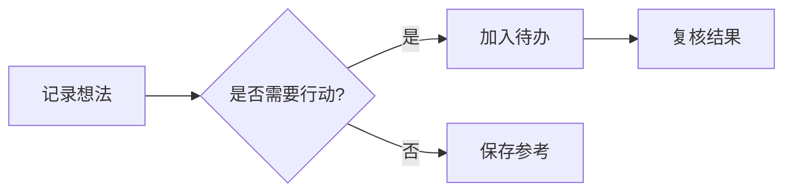

# Markdown 全景：GFM、GitHub 与 Nine Rings

这是一份可编辑的语法演示。点击「源码」查看写法，开启「并排预览」比较源文与效果，也可以切到只读模式检查跳转、折叠和复制。示例中的任务可直接勾选。

**范围**：覆盖 CommonMark/GFM 的全部语法类别、GitHub 官方写作功能及 Nine Rings 的 Markdown 扩展；不逐项罗列规范里的每一种边界输入。支持的内容直接演示，网站专属或尚未支持的功能给出源码和说明，避免把它们误当作本地功能。

```toc
levels: 2,3
```

## 一、标题、段落与换行

### ATX 六级标题

下面是六级标题的实际效果；连续标题也可用于检查字号、间距和目录颜色。

# H1：一级标题示例
## H2：二级标题示例
### H3：三级标题示例
#### H4：四级标题示例
##### H5：五级标题示例
###### H6：六级标题示例

### Setext 标题与结束标记

Setext 一级标题
================

Setext 二级标题
----------------

### 带结束标记的标题 ###

### 段落、空行与软换行

这是一个段落的第一行，
源码中换行后仍属于同一段落，在渲染中用空格连接。

空行开始一个新的段落。空行数量不会直接变成相同数量的正文空白。

### 硬换行

这一行以两个空格结尾。  
这一行应该换行，但仍在同一个段落中。

这一行以反斜线结尾。\
这一行也应产生硬换行。

### 分隔线

三个或更多星号、减号或下划线可生成分隔线；段落与减号之间保留空行，避免误判为 Setext 标题。

***

---

___

## 二、强调、行内代码、转义与实体

### 强调与删除线

*星号斜体*、_下划线斜体_、**星号粗体**、__下划线粗体__、***粗体加斜体***、~~删除线~~。

**粗体中包含 *斜体***，*斜体中包含 **粗体***，以及 **[粗体链接](https://github.github.com/gfm/)**。

`snake_case` 中的下划线不会把单词中间变成强调；普通文本 foo_bar_baz 也应保持原样。

### 行内代码与反引号

行内代码 `const count = 3;` 使用等宽字体；代码中的 `*星号*`、`<mark>` 和 `\` 是字面量。

双反引号允许包含单个反引号：``这里有 `backtick`，也有 | 竖线``。

### 反斜线转义

\*这不是斜体\*，\[这不是链接\]，\# 这不是标题，\`这不是代码\`，以及反斜线 \\。

1\. 这一行以普通文本开头，不是有序列表。

### 字符实体

命名实体：&amp; &lt; &gt; &quot; &copy;。十进制实体：&#65;。十六进制实体：&#x4E2D;。

代码 span 内不解码实体：`&amp; &#65;`。

## 三、列表与任务

### 无序列表与嵌套

- 第一项：使用减号。
- 第二项：子项按正文开始的位置缩进。
  - 子项 A，含 **粗体** 与 `行内代码`。
    - 第三层子项。
  - 子项 B。

* 使用星号也可以。
* 同一列表的第二项。

+ 使用加号也可以。
+ 同一列表的第二项。

### 有序列表、起始编号与右括号

3. 从 3 开始。
4. 下一项显示为 4。
   - 有序列表中的无序子项。
5. 下一项显示为 5。

1) 右括号也是合法的有序标记。
2) 第二项。

### 紧凑与松散列表

- 紧凑第一项。
- 紧凑第二项。

- 松散第一项。

- 松散第二项。

### 多段列表、引用与代码归属

1. 这是第一项的正文。

   这是同一项的第二段；缩进到列表正文列。

   > 这是属于第一项的引用，包含 `代码`。
   >
   > - 引用里的列表项。
   > - 另一个列表项。

   ```js
   const owner = "第一项";
   console.log(owner);
   ```

2. 这是第二项。

> 这个引用没有列表缩进，属于文档顶层。

```text
这个代码块也属于顶层。归属由缩进决定，不能仅凭相邻空行判断。
```

### GFM 任务列表

- [x] 渲染 Mermaid 图表
- [x] 渲染脚注
- [ ] 试着编辑这个列表
  - [ ] 一个嵌套待办

Nine Rings 还允许空待办项（项目扩展）：

- [ ]

## 四、引用与代码块

### 多段与嵌套引用

> 引用的第一段，含 **粗体**、*斜体* 与 `行内代码`。
>
> 第二段：引用可以包含列表、标题和代码。
>
> - 第一项。
> - 第二项。
>
> > 这是嵌套引用。
>
> ```python
> print("引用中的代码")
> ```

### 缩进代码

下面的四空格缩进生成代码块；其中的 Markdown 不解析为格式。

    const literal = "**不加粗**";
    console.log(literal);

### 围栏代码、语言与 info

```typescript example.ts
interface Idea {
  title: string;
  done: boolean;
}

const idea: Idea = { title: "记录一个想法", done: false };
console.log(idea);
```

波浪线围栏也支持；未知语言保留源文，未必提供专门高亮。

~~~text
这一行可以直接包含 ```，不会结束波浪线围栏。
~~~

使用更长的外层围栏可以展示 Markdown 代码块本身：

````markdown
```js
console.log("内层代码");
```
````

## 五、链接、图片与锚点

### 内联链接与 title

[GFM 规范](https://github.github.com/gfm/ "GitHub Flavored Markdown")；目标中的平衡括号：[带括号的地址](https://en.wikipedia.org/wiki/Function_(mathematics))。

### 引用式、折叠式与快捷式链接

[规范全文][gfm-spec]、[GitHub 写作指南][]、[GFM]。

[gfm-spec]: https://github.github.com/gfm/ "GFM 官方规范"
[GitHub 写作指南]: https://docs.github.com/en/get-started/writing-on-github
[GFM]: https://github.github.com/gfm/

链接定义本身不会显示为正文。

### 自动链接

标准自动链接：<https://github.github.com/gfm/>、<demo@example.com>。

GFM 扩展自动链接：https://github.github.com/gfm/、www.github.com，以及 demo@example.com。

### 文档内标题跳转

[跳到 GFM 表格](#六gfm-表格)，[跳到 Nine Rings 扩展](#九nine-rings-扩展)。这些跳转使用完整标题，不受目录标签截断影响。

### 图片与替代文本

下面的图标使用随应用提供的本地资源；网络离线时仍可显示。alt 描述和 title 应保留。


行内图片位于文字中间：前面  后面。

引用式图片也支持：![引用图标][demo-icon]。

图片可以作为链接：[](https://github.github.com/gfm/)。

[demo-icon]: /icon-192.svg "引用式图片"

源码中的图片相对路径由资源来源决定；外部文件链接示例见下一节，Markdown 不会自动把本机磁盘文件上传到 GitHub。

### 相对文件与稳定文档链接

源文件中的写法示例：

```markdown
[同目录文档](./guide.md)
[上级目录文档](../overview.md)
```

这些是语法示例，本演示没有附带上述文件。Nine Rings 根据导入时保存的原文件名、文档路径和目标名称解析相对 `.md` 引用；直接编写的文档推荐使用 `[[` 候选选择，建立基于文档 ID 的链接。修改文档名称后，这类 ID 链接仍指向同一文档。

## 六、GFM 表格

### 对齐、行内格式与转义竖线

| 左对齐 | 居中 | 右对齐 |
| :--- | :---: | ---: |
| **粗体** 与 *斜体* | `行内代码` | 128 |
| [规范](https://github.github.com/gfm/) | ~~旧方案~~ | 256 |
| 普通竖线 \| | `代码里的 \|` | 512 |
| 第一行<br>第二行 | HTML 换行 | 1024 |

### 可省略外侧竖线

功能 | 状态
:--- | :---:
主题 | ✅ 完成
分栏 | ✅ 完成
⌘K | ✅ 完成

表格以表头列数为准；正文缺少的单元格补空，多余的单元格不进入表格。分隔行的列数必须与表头一致。宽表提供水平滚动，小表保持紧凑。

## 七、GitHub 补充功能

### 脚注：命名、多次引用与多段正文

这是首次引用[^first-note]，再次引用同一个脚注[^first-note]；另一个脚注使用中文标签[^中文说明]。点击上标跳到文末，点击脚注尾部箭头分别返回每个引用位置；桌面悬停上标可查看内容。

[^first-note]: 这条定义写在引用附近，但渲染时汇总到文末。

    第二段包含 **强调** 与 `行内代码`，证明脚注不是只能写一行。

[^中文说明]: 标签可以是中文；显示编号按首次引用顺序生成。

刻意转义的 \[^first-note] 保持普通文本。编辑正文后结构化导出可能将脚注定义移到末尾；在未做渲染编辑时，源码缓存保留原始定义位置。

### 数学公式

行内公式：$E = mc^2$；GitHub 美元加反引号的写法：$`a^2 + b^2 = c^2`$。

块级公式：

$$
\int_0^1 x\,dx = \frac{1}{2}
$$

GitHub `math` 围栏：

```math
\begin{aligned}
f(x) &= x^2 + 2x + 1 \\
     &= (x + 1)^2
\end{aligned}
```

Nine Rings 使用本地 KaTeX，离线和手机端也能呈现；与 GitHub MathJax 的所有宏并不保证完全相同。

### GitHub 提示引用

> [!NOTE]
> 补充理解正文的背景信息。

> [!TIP]
> 推荐一个更省时的操作方法。

> [!IMPORTANT]
> 记录读者需要留意的关键条件。

> [!WARNING]
> 在采取操作前说明可能造成的影响。

> [!CAUTION]
> 说明应谨慎处理的具体步骤。

### Mermaid 图表



Mermaid 可在独立图块中折叠、复制、查看源码和放大；本地库版本及配置可能与 GitHub 不同。

### 折叠区块与嵌套

<details>
<summary>点击展开：一份可折叠的补充说明</summary>

这里支持 **Markdown 正文**、`行内代码` 和列表。

- 第一步：展开此区域。
- 第二步：在编辑与只读模式中分别尝试折叠。

<details>
<summary>第二层补充说明</summary>

这是嵌套的 details 正文。

</details>

</details>

### GitHub 网站专属能力与其它图型

以下功能需要 GitHub 的账号、仓库或服务，不属于本地 Markdown 内核。此处给出标准写法，Nine Rings 不会查询 GitHub 或伪造这些结果。

```markdown
@octocat
@organization/team
#123
owner/repository#123
:smile:
`#0969DA`
```

上述写法分别涉及 mention、团队 mention、issue/PR 引用、跨仓库引用、emoji shortcode 和 GitHub 颜色预览。普通 Unicode emoji 如 🙂 ✅ 仍直接显示。

GitHub 还支持 GeoJSON/TopoJSON 地图和 ASCII STL 三维模型。Nine Rings 当前将这些语言的围栏作为代码展示，不渲染地图或三维模型。例如：

```geojson
{"type":"Point","coordinates":[116.4,39.9]}
```

```topojson
{"type":"Topology","objects":{},"arcs":[]}
```

```stl
solid demo
endsolid demo
```

GitHub 附件上传、视频展示、自动 README 相对地址及仓库专属引用同样由网站环境提供。

## 八、受限 HTML 与安全呈现

### 高亮、上下标、插入文本与换行

<mark>高亮文本</mark>、H<sub>2</sub>O、x<sup>2</sup>、<ins>插入的文本</ins>、<b>HTML 粗体</b>、<i>HTML 斜体</i> 和 <del>HTML 删除线</del>。

使用 HTML 硬换行：第一行<br>第二行。

### 自定义锚点

<a id="demo-anchor"></a>
这里是命名锚点的目标。点击 [返回这个自定义锚点](#demo-anchor) 可定位到本段。

### 不可见注释

下面两句话之间有 HTML 注释；只在源码中能看到注释正文。

注释之前。

<!-- demo-comment: 这段信息不应出现在正文中。 -->

注释之后。

### 原始 HTML 与标签过滤

GFM 包含原始 HTML 的语法和危险标签过滤；GitHub 网站还会额外清洗 HTML。Nine Rings 有意只呈现受限白名单，不执行任意 HTML、脚本、事件或用户 CSS。以下是原始 HTML 的写法示例；此处放在代码围栏中，不声称它们具有本地网页功能。

```html
<div>一个原始 HTML 块</div>
<!-- 注释 -->
<?processing instruction?>
<!DOCTYPE html>
<![CDATA[一些文字]]>
<script>/* 不执行 */</script>
<style>/* 不应用 */</style>
<iframe src="https://example.com"></iframe>
```

Nine Rings 未支持的实际 HTML 保存为不可执行的源码块或片段。GFM 的过滤标签包括 `title`、`textarea`、`style`、`xmp`、`iframe`、`noembed`、`noframes`、`script` 和 `plaintext`；这不代表其它 HTML 会被 GitHub 无条件接受。

## 九、Nine Rings 扩展

### 自动目录：toc 与 /toc

文档开头的目录来自 `toc` 围栏，会随标题编辑自动更新。`levels` 选择展示级别，例如 `2,3`。在渲染编辑区的空段落输入 `/toc` 后按空格或回车，可插入目录块；目录的设置可调整 H1–H6。

````markdown
```toc
levels: 2,3
```
````

GitHub 会把 `toc` 围栏作为普通代码，不自动生成这种目录。

### 独立流程块：flow

````flow
## 捕捉

**输入**：一次观察。

- 记录问题和背景。
- 写下期望结果。

**输出**：一个明确的问题。

## 行动

**输入**：上一阶段的问题。

> 先完成一个最小步骤，再决定是否继续。

```js
const next = "执行一个最小步骤";
```

- [ ] 完成步骤
- [ ] 记录结果

## 复核

| 检查项 | 结果 |
| :--- | :--- |
| 目标是否达到 | 等待验证 |
| 下一步 | 修改或归档 |

**输出**：可观察的结果。
````

流程块内部使用 Markdown，通常按 H2 生成阶段。内部有代码围栏时，外层使用四个反引号。可选择文字、复制、折叠、切换源码和进入块模式；GitHub 会将整个 flow 展示为代码。

### 文档链接：输入 [[

在渲染编辑区输入 `[[`，选择候选文档或继续输入名称过滤；Esc 关闭候选。选择后插入基于文档 ID 的链接，不要求两份文档在操作系统中有共同目录。

`[[文档名称]]` 在这里展示的是操作写法，直接导入这串字符不会自动绑定一份同名文档。

### 快捷待办：/todo

在空段落输入 `/todo` 后按空格或回车，可插入待办。正文任务列表与随记中的待办使用同一种文档内容，不需要另一种文件格式。

### 数学扩展

括号形式的行内公式：\(a + b = c\)。这是 Nine Rings 扩展；GitHub 的可移植写法推荐 `$…$`。

### 块模式、手动缩进与排版

代码、引用、Mermaid、flow、details 等块可以通过工具栏复制、折叠或进入块模式。details 块模式区分摘要与正文。代码使用等宽字体；其它块的字体、字号以及 H1–H6 字号可在排版设置中单独调整。

支持的块可以通过 Tab / Shift+Tab 或工具栏调整缩进；当前块最多比上一块深一级。手动缩进属于编辑器展示属性，不会重新定义 GFM 列表的源文归属。

折叠、块标题、字体、颜色、手动缩进等 UI 属性由工作区数据保存，Markdown 导出不一定承载；需要完整备份时使用 JSON 或工作区同步。

### 可编辑示例与源码保留

这份文档在首次安装或升级时添加到 ideas，一次创建后不会覆盖你的修改，也不会因重启而恢复已经删除的副本。初始源文保留示例的标记与脚注定义位置；渲染编辑后的规范化导出可能调整空行、表格空格和脚注位置。

## 十、规范与进一步阅读

- [GitHub Flavored Markdown 规范](https://github.github.com/gfm/)
- [GitHub 基础写作与格式](https://docs.github.com/en/get-started/writing-on-github/getting-started-with-writing-and-formatting-on-github/basic-writing-and-formatting-syntax)
- [GitHub 数学公式](https://docs.github.com/en/get-started/writing-on-github/working-with-advanced-formatting/writing-mathematical-expressions)
- [GitHub 图表与模型](https://docs.github.com/en/get-started/writing-on-github/working-with-advanced-formatting/creating-diagrams)
- [GitHub 折叠区块](https://docs.github.com/en/get-started/writing-on-github/working-with-advanced-formatting/organizing-information-with-collapsed-sections)
- [原始 Markdown 语法](https://daringfireball.net/projects/markdown/syntax)

可以把这份演示作为阅读、编辑、只读、源码并排预览和手机布局的共同检查文档。
